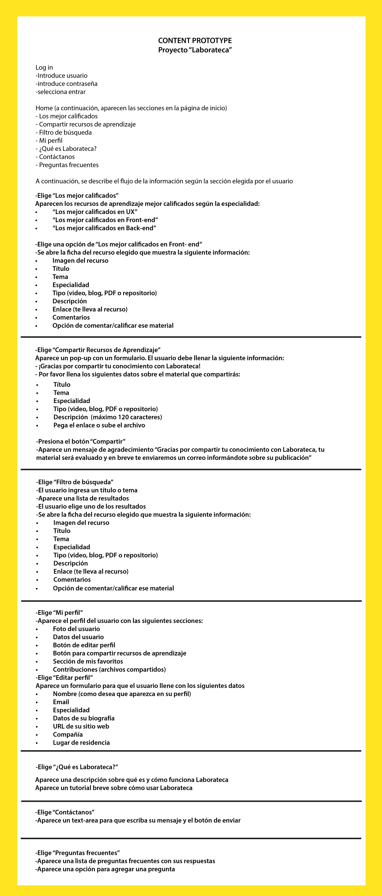
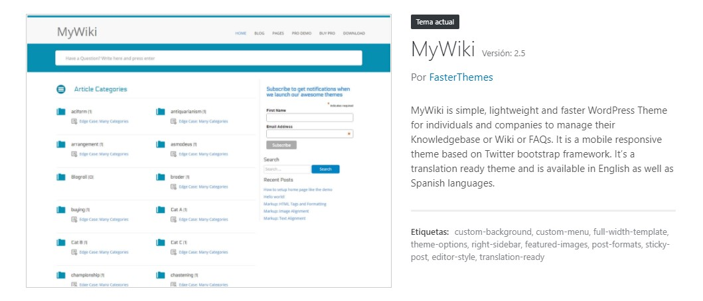
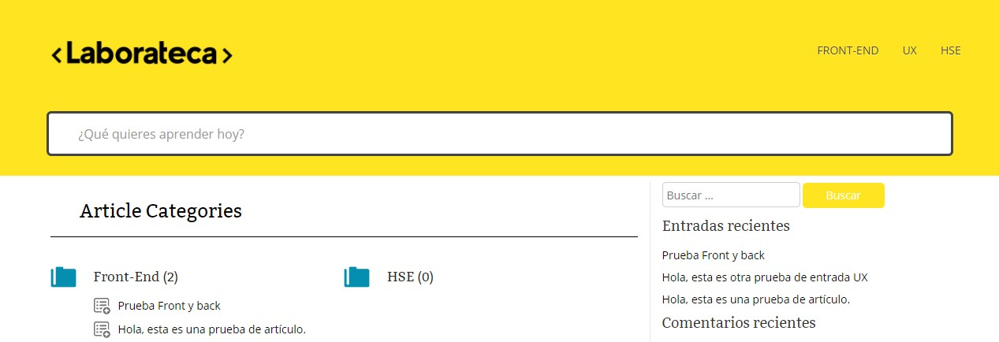
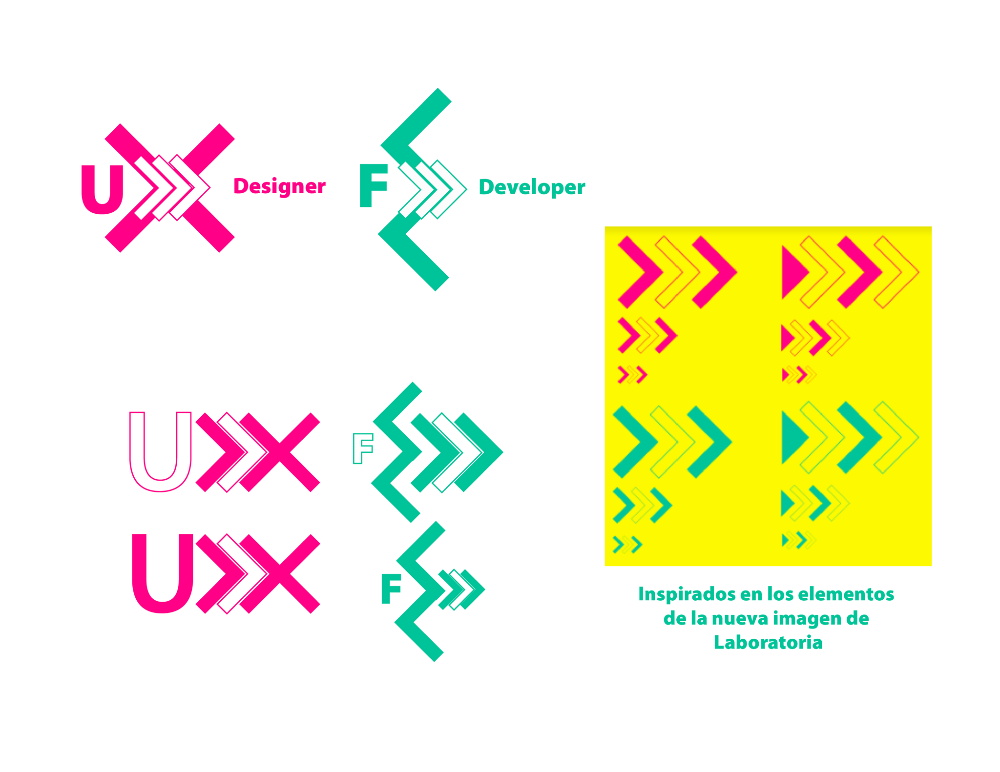
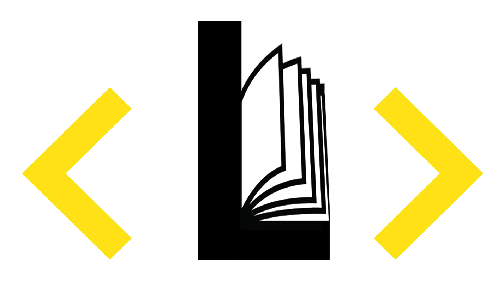

## L A B O R A T E C A

### DOCUMENTACIÓN UI

***
El equipo de UI trabajó respetando al 100% la identidad e implementación de la marca de **<Laboratoria\>**

# B A C K L O G

* Primero se realizó el diseño del flujo de la información de Laborateca

* Diseño de los logotipos par las categorías definidas por UX
       * HSE
       * FE
       * UX
* Diseño de isotipos por tipo de contenido

      * Libro
      * PDF
      * Artículo
      * Tutorial
      * Blog
      * Repositorio
* Realización de Mockups
* Diseño de logotipo de **<Laborateca\>**
* Cambio del estilo en CSS acorde a **<Laboratoria\>**
* Integración de logos e isotipos
* Crear diseños para las redes sociales de **<Laborateca\>**

# P r o c e s o

* Se modificó el tema de WordPress *MyWiki*

Se trabajó en el editor de CSS desde el panel de Administración

Propuesta de isotipos para las especialidades de FE y UX

* Isotipo para libros

* Isotipo para Front End

* Isotipo para UX

***
## EQUIPO DE TRABAJO UI

* Scrum Master: Abril Juárez Soriano
* Angélica Fuentes
* Karina Mosqueda
* Jocelyn Esquivel
